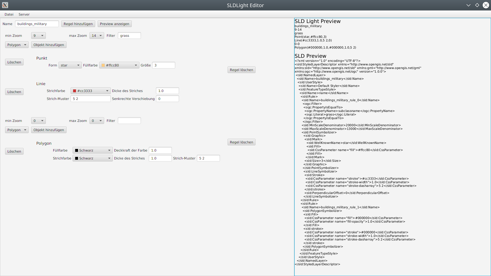

# SLDlight
A smaller reduced SLD for OHDM

## Goal
The goal of this project was to create a smaller, easier to handle version of the `Styled Layer Descriptor (.sld)` styling format.
SLD-files are pretty verbose and repetetive so the new format (called `SLDLight (.sldl)`) aims to reduce the possible configuration options to the most commonly used options.

## Editor
Additionally a GUI-editor was created to make the creation of `.sldl` files even more convenient.
The editor uses the JavaFX framework.

It supports
- saving the current configuration to an `.sldl`-file
- opening an existing `.sldl`-file and using its values to fill in the editor
- uploading the current configuration to the OHDM-server

## Docs
This project was created as part of a term paper. The [written elaboration](docs/Hauptdatei.pdf) is available in German language only.
